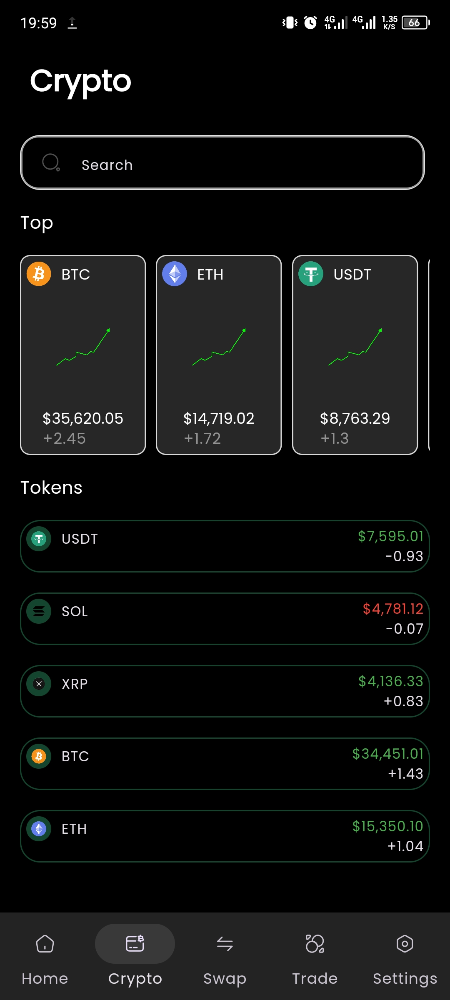
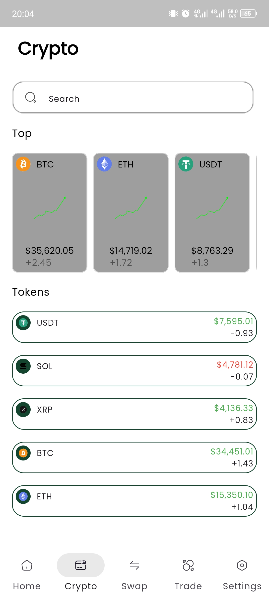
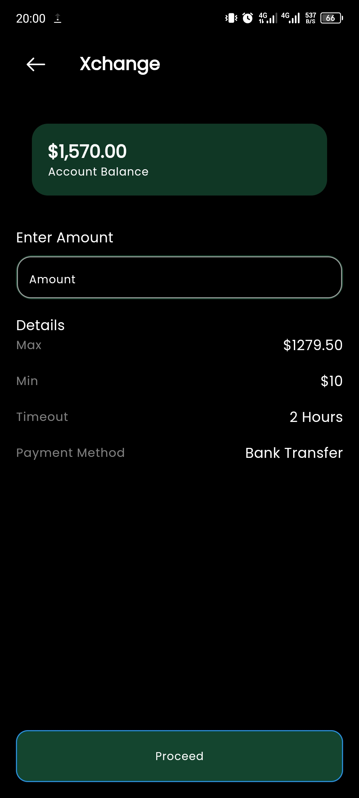
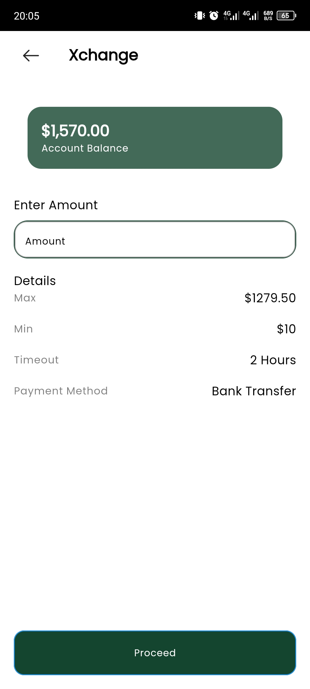

# Cryptoknight
Crypto knight is a clean flutter UI, built with two modes. The light mode and dark mode, it uses getX state management. Feel free to hit me up for suggestions, upgrades or if you need any help with this repo. ✌🏼

Below are screenshots of crypto knight app.

#Home Page

Home screen in dark screen mode.

Home screen in  light screen mode

#Crypto Page

Crypto tokens page in dark screen mode

Crypto tokens page in light screen mode

#Xchange page

Xchange page dark screen mode

Xchange page light screen mode
